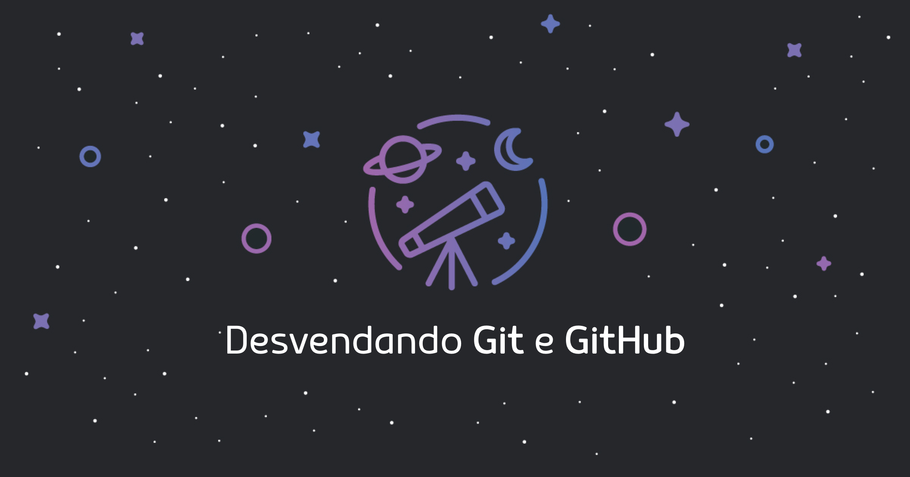

# Desvendando Git e GitHub

##  **GitHub** é como as pessoas constroem software

Trabalhar com controle de versão é uma habilidade essencial para qualquer desenvolvedora de software gerenciar sua base de código, acompanhar as alterações e coordenar a colaboração entre uma equipe.

Neste curso, você aprenderá sobre:

1. [Criando uma conta e seu primeiro repositório no GitHub](git-e-github/setup.md)
2. [Setup de instalação](git-e-github/setup-de-instalacao.md)
3. [Vocabulário](git-e-github/conceitos-e-vocabulario-do-git.md)
4. [Trabalhando com repositórios](ciclo-de-vida-basico/criando-um-repositorio.md)
5. [Comandos mais utilizados](ciclo-de-vida-basico/comandos-mais-utilizados.md)
6. [Trabalhando com branchs](ciclo-de-vida-basico/trabalhando-com-branchs.md)
7. [Restringindo arquivos com .gitignore](ciclo-de-vida-basico/o-que-e-o-.gitignore.md)
8. [Dicas de boas práticas](dicas-boas-praticas/dicas-de-boas-praticas.md)
9. [Atividades hands-on](ciclo-de-vida-basico/hands-on-1.md)

## **Sobre a nossa comunidade**

A WoMakersCode é uma **comunidade** sem fins lucrativos, que busca o **protagonismo feminino na tecnologia**, através do desenvolvimento profissional e econômico. Oferecemos workshops, eventos e debates com foco no mercado de Tecnologia, orientados para capacitação técnica e fortalecimento de habilidades pessoais. Nossos eventos são realizados em diversas cidades do país, promovendo a conscientização da igualdade de gênero e buscando compreender as causas da sub-representação feminina neste mercado de TI.

## **Contribua para esse guia**
Veja detalhes no nosso [guia de contribuição](https://github.com/WoMakersCode/git-e-github/blob/master/CONTRIBUTING.md)

## **Quem já contribuiu com esse guia**

[Cynthia Zanoni](https://github.com/cyz)   
[Kamila Santos](https://github.com/Kamilahsantos)   
[Caroline Pinheiro](https://github.com/CarolPinheiro)  
[Leticia Campos](https://github.com/leticiacamposs2)  
[Ester Gama](https://github.com/esterfania)  
[Letícia Vargas](https://github.com/leticiavargas)
[Danielle Farias](https://github.com/danielle8farias/)

**Acompanhe nossos canais e ajude-nos a crescer:**

**→** [**Participe de nossos Meetups** ](https://www.meetup.com/pt-BR/WoMakersCode/) **→** [**Conheça nosso portal**](http://womakerscode.org/)\*\*\*\*

**→ Siga em:** [**Facebook**](https://www.facebook.com/womakerscode/) **//** [**Twitter**](https://twitter.com/womakerscode) **//** [**Instagram**](https://www.instagram.com/womakersgram/) **//** [**Youtube**](https://www.youtube.com/womakerscode)\*\*\*\*

