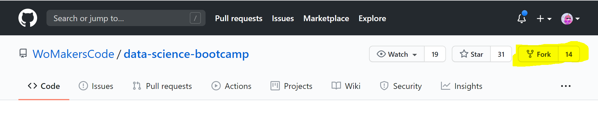
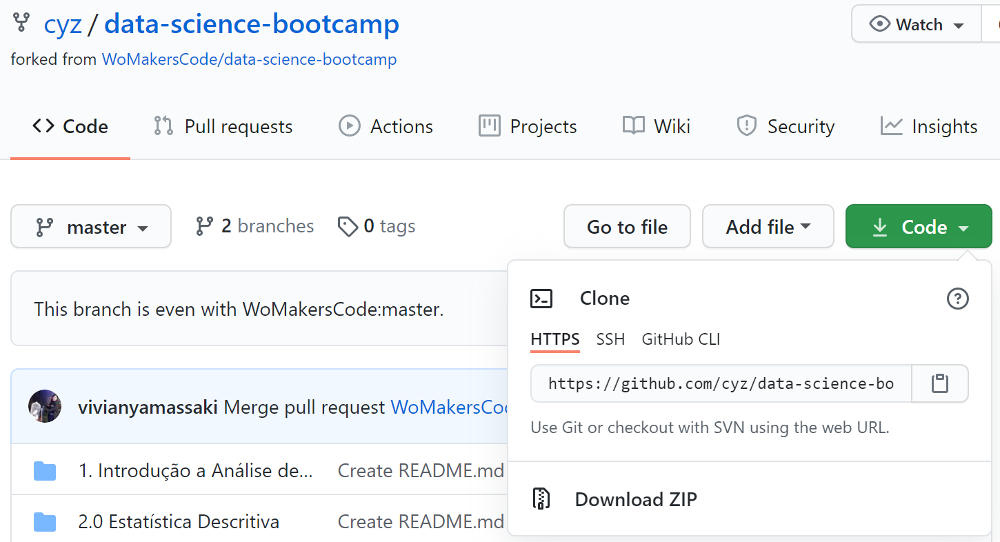
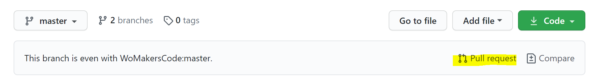
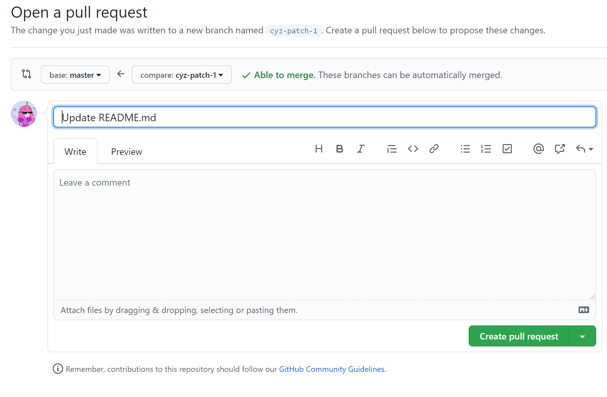

# Hands-on: Como fazer um fork e contribuir com outros projetos

Um fork do GitHub é uma cópia de um repositório (repo) que fica em sua conta. Depois de fazer um fork (bifurcar) de um repositório, você poderá editar o conteúdo de seu repositório bifurcado sem afetar o repositório principal. Quando desejar, poderá enviar suas alterações para o repositório principal.

## Criando o fork

Supondo que você esteja usando o GitHub, essa etapa é fácil. Apenas encontre o repositório para o qual você está contribuindo e pressione o botão Fork no canto superior direito. Isso criará uma cópia exata do repositório (e todos os seus ramos) com seu próprio nome de usuário.



## Clonando o repositório bifurcado

O GitHub o redirecionará automaticamente para o repositório bifurcado com o seu nome de usuário. Este é o repositório que você precisa para clonar em seu ambiente de desenvolvimento local, não o original. Pegue a URL fornecida pelo GitHub no botão verde "Clonar ou Baixar" e conecte-a ao comando abaixo.



```
git clone https://github.com/cyz/data-science-bootcamp.git
```

## Mantendo seu repositório bifurcado com o repositório principal

Depois de fazer o fork de um repositório, as alterações no repositório original (ou "upstream") não são enviadas para o seu fork. Precisamos dizer ao novo repositório para seguir as mudanças feitas no upstream para mantê-lo atualizado por meio de controles remotos.

Alterne os diretórios para o repositório bifurcado que você acabou de clonar e execute os seguintes comandos. Substitua a última parte da primeira linha pelo URL do clone do repositório **original** - semelhante ao modo como você pegou o URL na etapa 2, mas **não é** aquele com seu nome de usuário.

Isso vincula a bifurcação de volta ao repositório original como um remoto, que nomearemos ``upstream``, depois o buscaremos.

```
git remote add --track master upstream https://github.com/WoMakersCode/data-science-bootcamp.git
git fetch upstream
```

## Criando uma nova branch para realizar mudanças

É possível fazer alterações diretamente na branch `master`, mas isso pode FUBAR as coisas no futuro por motivos complicados. É melhor criar um `checkout` novo ramo para **cada** mudança / melhoria que você deseja fazer. Substitua `fix-readme-typo` por um nome mais descritivo para suas alterações, como `add-study-references` ou `update-dependencies`.

```
git checkout -b fix-readme-typo upstream/master
```

## Faça suas alterações!

Essa é a parte mais fácil ou a mais difícil, dependendo de como você a encara. 😉 Neste ponto, você está isolado no novo branch que acabou de criar e é seguro abrir qualquer editor de texto ou IDE que usar e enlouquecer.

## Adicione, confirme e envie as alterações

Você provavelmente está acostumado com esses comandos. Adicione os arquivos que você alterou e envie-os com uma mensagem descritiva.

```
git add .
git commit -m "Ajustando alguns erros gramaticais no arquivo readme"
```

A única diferença é o ramo para o qual você está empurrando. Você provavelmente costuma enviar `push` para master, mas, neste caso, estamos enviando para o branch com o nome que você criou na etapa 4.

```
git push -u origin fix-readme-typo
```

## Criando o seu Pull Request (PR)

Agora você está pronto para enviar a melhoria feita aos mantenedores do projeto para aprovação. Ao acessar o seu repositório bifurcado em sua conta, você irá encontrar um aviso de que há uma branch disponível para Pull Request.



Vá para a guia Pull Requests do repositório original e você verá uma sugestão automática do GitHub para criar uma solicitação pull de seu novo branch.


