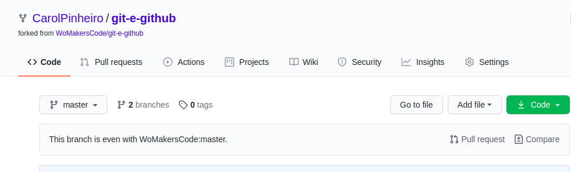
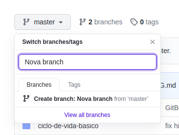
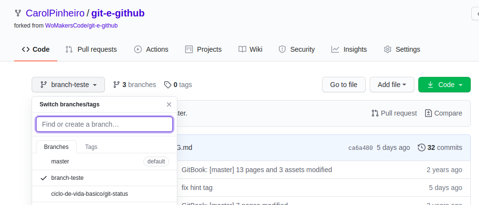
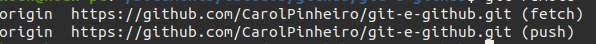
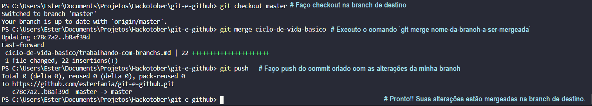

# Trabalhando com branchs

## 1. O que é uma branch?

Acho que, sem sombra de dúvidas, quando começamos a mexer com github essa é a primeira dúvida que vem à nossa mente. Afinal, o que são as famosas branches que todos falam?
Para explicar isso, eu gostaria de usar um exemplo mais prático, misturado com algo visual.
Quando pesquisamos no google o que são branches, a primeira imagem que nos aparece é essa daqui:

E se você nunca teve contato anteriormente com isso, pode ser meio assustador, mas não se preocupe, é mais fácil do que parece.
Branch, é o nome dado para o sistema de versionamento que usamos através do Git e Github, para manter controle dos projetos.
Vamos supor que estivéssemos construindo uma calculadora juntos, e decidíssemos que você cuidaria de criar a operação de soma e eu a de subtração.

Quando começamos um projeto, sempre nos encontramos na Master, a branch principal, e quando estamos trabalhando sozinhos ou até mesmo em grupo, é interessante que criemos "cópias" de um momento da nossa master, para podermos trabalhar com as novas features (por exemplo uma nova operação matemática), sem afetar o código que já se encontra funcionando.
Ou seja, quando você fosse desenvolver a funcionalidade de soma da nossa calculadora, você criaria uma branch à parte da master, com tudo que ela possuísse naquele momento para que pudesse criar os códigos sem se preocupar em afetar o código que já possuíamos naquele momento.

## 2. Como criar uma branch
Se você deseja criar uma branch via linha de comando, basta ir até o seu terminal (caso você seja usuário de Windows, pode usar o powershell ou, se quiser, baixar o Git Bash [aqui](https://gitforwindows.org/)) e digitar dentro da pasta onde está o seu projeto: 

    git branch nome-da-sua-branch
E depois para acessar a  branch:

    git checkout nome-da-sua-branch 
Caso você queira em qualquer momento saber em qual branch se encontra, basta digitar:

    git branch
E a branch onde você se encontra vai aparecer com um * ao lado e colorida, dependendo do terminal que você esteja usando.
Caso queira ganhar tempo criando a branch e já indo para ela, basta digitar:

    git checkout -b nome-da-sua-branch
E assim que a branch for criada, você já será levado para ela.
Vale ressaltar que é uma boa prática darmos o nome às nossas branches com referência à feature que iremos desenvolver nelas, o que no nosso caso, seria "soma", por exemplo.

**Caso você esteja usando o github, basta seguir os seguintes passos**
Abra seu repositório depois de realizar o Fork ou criar um repositório novo. 

Clique onde está escrito master, e digite lá o nome da branch que deseja criar

Depois disso basta clicar em *Create branch*, para que a branch seja criada remotamente.

## 3. Como alternar entre branches
Conforme explicado acima, podemos usar `git checkout nome-da-branch` para alternar entre as branches, mas existe outra forma também, que é: 

    git switch nome-da-branch 
Que funciona da mesma forma que a anterior, e pode ser usada para navegar entre as branches. 
**Para alterar entre as branches no github basta seguir o seguinte passo**

Basta clicar em master, e selecionar entre as branches disponíveis, para qual você deseja ir.
## 4. Como subir uma branch local para um repositório remoto
Antes de subirmos nossa branch, precisamos verificar se nosso repositório local está com o link do repositório remoto configurado.
Para isso, digite no terminal:

    git remote -v
  Caso você já tenha algum repositório no github conectado a ele, a resposta vai ser parecida com isso (um exemplo com um repositório meu):
  
  No entanto, caso não retorne nada, você pode criar um repositório no seu github e associar a ele através do comando:
  
	git remote add origin https://github.com/CarolPinheiro/git-e-github.git 
E já vai poder subir suas branches.
Para isso, basta inicialmente digitar o comando:

    git add arquivos-alterados
Adiciona os arquivos selecionados para a área de Stage, onde de uma forma simples, você prepara os arquivos para o commit (ou seja, registrar as atualizações e alterações do projeto). Para commitar basta digitar:

    git commit -m "Mensagem do commit"
O **-m** significa 'message', ou seja ali você digita a mensagem que vai registrar aquela alteração, por exemplo "Função de soma criada".
Assim que o commit tiver sido feito, basta ir no terminal e digitar:

    git push
E sua branch já está disponível remotamente no github.
## 5. O que é um merge?
Estamos entendendo como trabalhar com branchs, mas se quisermos trazer o trabalho que fizermos em uma branch para outra?

Possuo duas branchs em um repositório GIT, uma chamada "ciclo-de-vida-basico" e a outra "master", estou trabalhando na primeira e após a finalização quero trazer o meu trabalho para "master", pois ela é a principal branch e onde deve ser depositado todo o código que funciona.

Como fazer isso? Através do **merge**, que é quando pegamos um código de uma branch e adicionamos à outra branch, unificando assim as alterações. É importante para manter sua branch atualizada ou para levar seu código para a branch principal.

Para unificar duas branchs, ou seja, fazer com que o conteúdo da primeira seja adicionado à segunda, utilizamos o comando `git merge nome-da-branch-a-ser-mergeada` na branch de destino. 

Abaixo um exemplo de **merge**:

1º Fazer checkout na branch de destino. Minha branch de destino é master, então farei: `git checkout master`.
	
	git checkout nome-da-branch-destino
	
2º Executar o merge para unificar sua branch na de destino. Como o nome da minha branch é ciclo-de-vida-basico, farei: `git merge ciclo-de-vida-basico`.

	git merge nome-da-branch-a-ser-mergeada 
    
Esse comando fará que o GIT automaticamente crie um commit com o branch atual e todo o conteúdo da branch origem.

### Exemplo de um merge local:

Após fazer commit das alterações na minha branch de trabalho, estou apta para fazer merge:

