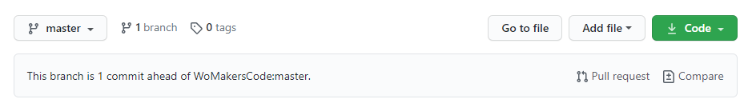
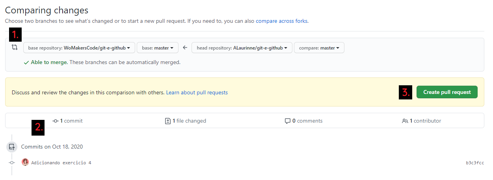
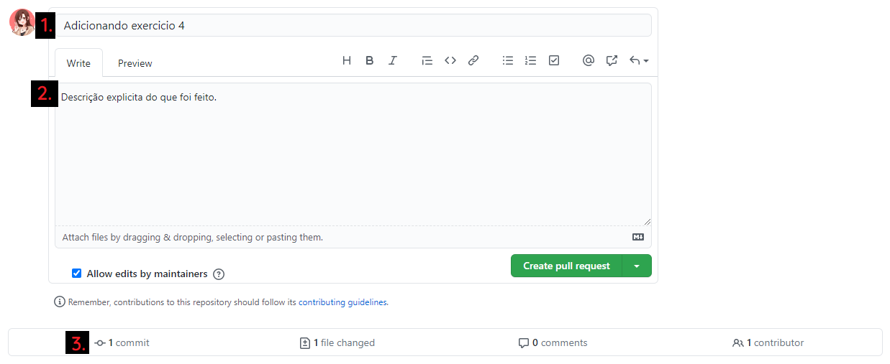

# Exercício 4

## Proposta

Adicionar um repositório remoto ao seu projeto local.

## Passos para realização:

### Adicionando um repositório remoto ao seu projeto local.

1. [Crie um repositório](https://github.com/WoMakersCode/git-e-github/blob/master/git-e-github/setup.md) no seu GitHub.
2. Acesse o diretório do seu projeto.
```
$ cd /Users/WoMakersCode/projeto
```
3. Inicie o Git dentro dessa pasta
```
$ git init
```
4. Víncule o repositório local com o repositório o remoto.
```
$ git remote add origin https://github.com/WoMakersCode/git-e-github.git
```

Pronto! Está vinculado. </br>
Ops, sua conta não esta configurada? Lembre-se de autenticar o seu usuário.

5. Autentique o seu usuário.
```javascript
// Seu nome e sobrenome
$ git config user.name "Nome Sobrenome"

// Email cadastrado no github
$ git config user.email "nome.sobrenome@email.com.br"
```

### Criando uma nova branch

1. Acesse o diretório do seu projeto.
```
$ cd /Users/WoMakersCode/projeto
```
2. Crie sua nova branch.
```
$ git checkout -b nome-da-sua-branch
```
2. Acesse o seu editor no diretório do projeto.
   - Caso seja o VS Code, utilize o comando `code .`


Você também pode verificar em qual branch está no momento ou alterar entre as branchs já criadas.
3. Verificando sua branch e alterações.
```
$ git status
```
4. Alterar a branch atual para uma já existente.
```
$ git checkout branch-existente
```

### Adicionando arquivos, comitando e enviando para o seu repositório remoto

1. Adicione as alterações feitas.
```javascript
// Adicionar todas as alterações
$ git add .

// Adicionar ou alterar arquivo especifico, utilize a pasta e a extensão dele.
$ git add hands-on/exercicio-4.md
```
2. Commite as alterações adicionadas.
```
$ git commit -m "Adicionando o exercicio 4"
```
3. Envie para o repositório remoto
```javascript
// Caso esteja confiante do seu código, pode subir direto na branch principal.
$ git push origin master

// Caso esteja fazendo alterações com outras pessoas, é preferivel utilizar apenas na sua branch.
$ git push origin minha-branch
```

### Fazendo uma pull request

Acesse o seu repositório no GitHub

1. Peça um pull request para suas alterações.

Pedindo um pull request.

1. Certifique-se do direcionamento do seu pull request, para onde vai e de onde vem o código.
2. Verifique as mudanças que estão vínculadas.
3. Crie o pull request.

Criando o pull request.

1. Coloque um título simples mas objetivo
2. Crie uma descrição explicita do que foi alterado ou criado.
3. Vefique as mudanças novamente.
4. CRIE O PULL REQUEST. 

Parabéns, o seu código já está na lista para ser mergeado com o repositório principal! :heart:
